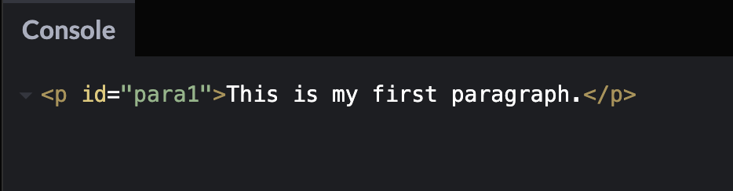
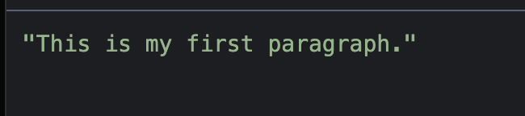
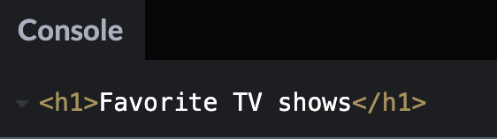
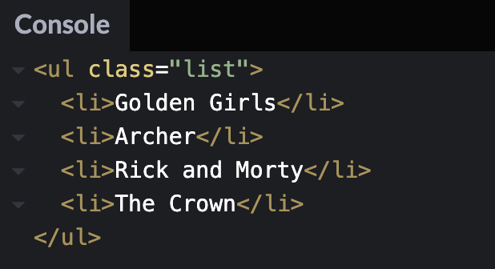
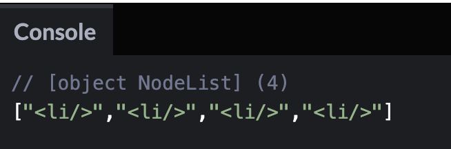
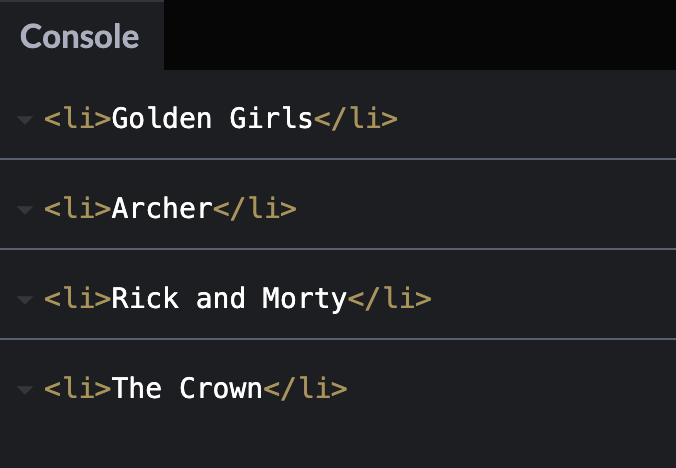
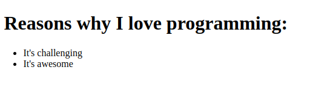
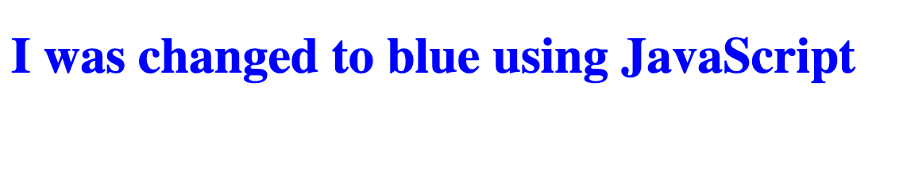
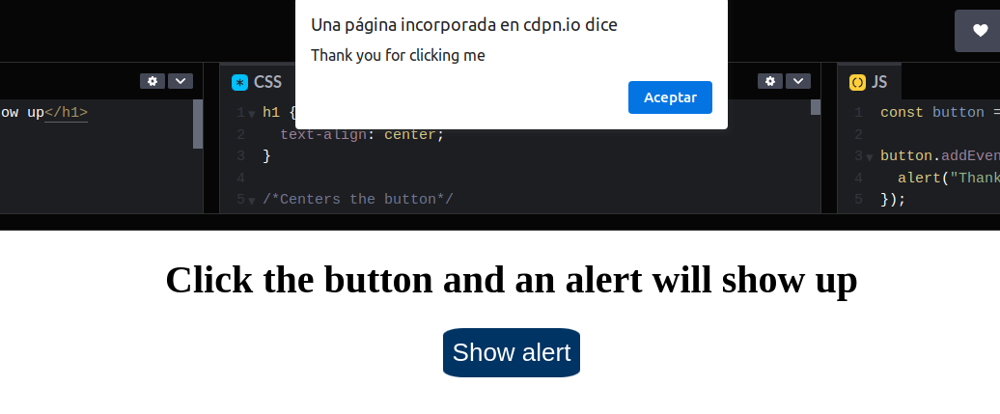

<p align='left'>
  
</P>

---

# `¿Qué es el DOM? El significado del Modelo de Objeto de Documento en JavaScript`

---

<a id="top"></a>

## `Bloques temáticos:`

- [**¿Qué es el DOM?**](#item1)
- [**Como seleccionar Elementos en el Documento**](#item2)
- [**Como usar la propiedad Style para cambiar estilos en línea de CSS**](#item3)
- [**Como usar el addEventListener() para escuchar eventos en la página**](#item4)
- [**Como usar el DOM en proyectos del mundo real**](#item5)
- [**Conclusión**](#item6)

---

---

En este artículo, explicaré que es el DOM y daré algunos ejemplos usando código de JavaScript.

Revisaremos como seleccionar elementos de un documento HTML, como crear elementos, como cambiar estilos en línea de CSS, y como escuchar los elementos.

<a id="item1"></a>

## `¿Qué es el DOM?`

DOM significa Document Object Model, en español sería Modelo de Objetos del Documento. Es una interfaz de programación que nos permite crear, cambiar, o remover elementos del documento. También podemos agregar eventos a esos elementos para hacer más dinámica nuestra página.

El DOM visualiza el documento de HTML como un árbol de tres nodos. Un nodo representa un documento de HTML.

Echemos un vistazo a este código de HTML para entender mejor la estructura de árbol del DOM.

```html
<!DOCTYPE html>
<html lang="en">
  <head>
    <meta charset="UTF-8" />
    <meta name="viewport" content="width=device-width, initial-scale=1.0" />
    <meta http-equiv="X-UA-Compatible" content="ie=edge" />
    <title>Estructura de árbol del DOM</title>
  </head>
  <body>
    <h1>Estructura de árbol del DOM</h1>
    <h2>Aprende sobre el DOM</h2>
  </body>
</html>
```

Nuestro documento se llama nodo raíz y contiene un nodo hijo el cual es el elemento `<html>`. El elemento `<html>` contiene dos hijos los cuales son los elementos `<head>` y `<body>`.

Ambos elementos `<head>` y `<body>` tienen hijos propios.

Aquí hay otra forma de visualizar este árbol de nodos.


Podemos acceder a estos elementos en el documento y hacer cambios a ellos usando JavaScript.

Veamos algunos ejemplos de como podemos trabajar con el DOM usando JavaScript.

---

---

<a id="item2"></a>

## `Como seleccionar Elementos en el Documento`

Hay diferentes métodos para seleccionar un elemento en el documento de HTML.

En este artículo, nos enfocaremos en tres de esos métodos:

- _getElementById()_
- _querySelector()_
- _querySelectorAll()_

**`getElementById()`**

En HTML, los ids se utilizan como identificadores únicos para los elementos HTML. Esto significa que no podemos tener el mismo nombre de id para dos elementos diferentes.

Esto sería incorrecto:

```html
<p id="para">This is my first paragraph.</p>
<p id="para">This is my second paragraph.</p>
```

Tendrías que asegurarte de que esos id sean únicos como los siguientes:

```html
<p id="para1">This is my first paragraph.</p>
<p id="para2">This is my second paragraph.</p>
```

En JavaScript, podemos tomar una etiqueta de HTML haciendo referencia al nombre del `id`.

```js
document.getElementById("nombre de id va aquí");
```

Este código le dice a la computadora que obtenga el elemento `<p>` que tiene el id de para1 y que imprima el elemento en la consola.

```js
const paragraph1 = document.getElementById("para1");
console.log(paragraph1);
```



Si deseamos leer solamente el contenido del párrafo, entonces podemos usar la propiedad textContent dentro del console.log().

```js
const paragraph1 = document.getElementById("para1");
console.log(paragraph1.textContent);
```



**`querySelector()`**

Puedes usar este método para encontrar elementos con uno o más selectores de CSS.

He creado este ejemplo de HTML con información de mis shows favoritos de tv:

```html
<h1>Favorite TV shows</h1>
<ul class="list">
  <li>Golden Girls</li>
  <li>Archer</li>
  <li>Rick and Morty</li>
  <li>The Crown</li>
</ul>
```

Si deseamos encontrar en la consola e imprimir el elemento `h1` , entonces podemos usar ese nombre de etiqueta dentro del `querySelector()`.

```js
const h1Element = document.querySelector("h1");
console.log(h1Element);
```



Si quisiera apuntar a `class="list"` para imprimir la lista no ordenada en la consola, entonces usaría `.list` dentro del `querySelector()`.

El `.` antes de `list` le dice a la computadora que apunte al nombre de la Clase. Si deseas apuntar a un `id` entonces te recomiendo usar el símbolo `#` antes del nombre.

```js
const list = document.querySelector(".list");
console.log(list);
```



**`querySelectorAll()`**

Este método encuentra todos los elementos que coinciden con el selector de CSS y devuelve una lista de todos esos nodos.

Si quisiera encontrar todos los elementos `<li>` en nuestro ejemplo, podría utilizar el combinador de hijos `>` para encontrar a todos los elementos hijos de `<ul>`.

```js
const listItems = document.querySelectorAll("ul > li");
console.log(listItems);
```



Si quisiéramos imprimir los elementos reales `<li>` con los shows de tv, podemos usar el ciclo `forEach()` para iterar sobre la NodeList e imprimir cada uno de los elementos.

```js
const listaDeElementos = document.querySelectorAll("ul > li");

listaDeElementos.forEach((item) => {
  console.log(item);
});
```



---

---

<a id="item3"></a>

## `Como agregar nuevos elementos al Documento`

Podemos utilizar `document.createElement()` para agregar nuevos elementos al árbol del DOM.

Veamos este ejemplo:

```html
<h1>Reasons why I Love programming:</h1>
```

Ahora, solo tengo una etiqueta `<h1>` en la página. Pero quiero agregar debajo de esa etiqueta `<h1>` una lista de razones por las cuales amo programar usando JavaScript.

Primero podemos crear un elemento `<ul>` usando `document.createElement()`. Asignaremos eso a una variable llamada `listaSinOrden`.

```js
let listaSinOrden = document.createElement("ul");
```

Después necesitaremos agregar ese elemento `<ul>` al documento usando el método `appendChild()` .

```js
document.body.appendChild(listaSinOrden);
```

El siguiente paso es agregar un par de elementos `<li>` dentro del elemento `<ul>` usando el método `createElement()` .

```js
let elemento1Lista = document.createElement("li");

let elemento2Lista = document.createElement("li");
```

Después podemos usar la propiedad `textContent` para agregar texto para nuestros 4 elementos de la lista.

```js
let elemento1Lista = document.createElement("li");
elemento1Lista.textContent = "It's Challenging";

let elemento2Lista = document.createElement("li");
elemento2Lista.textContent = "It's Awesome";
```

El último paso es usar el método `appendChild()` para que los elementos de la lista sean agregados a la lista sin orden.

```js
let elemento1Lista = document.createElement("li");
elemento1Lista.textContent = "It's Challenging";
listaSinOrden.appendChild(elemento1Lista);

let elemento2Lista = document.createElement("li");
elemento2Lista.textContent = "It's Awesome";
listaSinOrden.appendChild(elemento2Lista);
```

Así es como luce ya todo el código en conjunto.

```js
let listSinOrden = document.createElement("ul");
document.body.appendChild(listaSinOrden);

let elemento1Lista = document.createElement("li");
elemento1Lista.textContent = "It's Challenging";
listaSinOrden.appendChild(elemento1Lista);

let elemento2Lista = document.createElement("li");
elemento2Lista.textContent = "It's Awesome";
listaSinOrden.appendChild(elemento2Lista);
```

Así es como luce el resultado en la página:



[Subir al índice](#top)

---

---

<a id="item4"></a>

## `Como usar la propiedad Style para cambiar estilos en línea de CSS`

La propiedad style te da la habilidad de cambiar el CSS en tu documento de HTML.

En este ejemplo, vamos a cambiar el color del texto h1 de negro a azul usando la propiedad style .

Aquí nuestro HTML.

```html
<h1>I was changed to blue using JavaScript</h1>
```

Primero necesitamos tomar la etiqueta `h1` usando el método `querySelector()`.

```js
const h1 = document.querySelector("h1");
```

Después usamos `h1.style.color` para cambiar el texto `h1` de negro a azul.

```js
const h1 = document.querySelector("h1");
h1.style.color = "blue";
```

Así se ve el resultado en el navegador:



Puedes usar esta propiedad `style` para cambiar un número de inline styles de CSS incluyendo `background-color`, `border-style`, `font-size` y más.

[Subir al índice](#top)

---

---

<a id="item5"></a>

## `Como usar el addEventListener() para escuchar eventos en la página`

Este método te permite agregar un evento a un elemento de HTML como un botón.

En este ejemplo, cuando haces clic en un botón, aparecerá un mensaje de alerta.

En nuestro HTML, tenemos un elemento botón con el id de btn.

```html
<button id="btn">Mostrar Alerta</button>
```

Podemos apuntar a ese elemento en nuestro JavaScript usando el método `getElementById()` y asignando eso a una variable llamada `button`.

```js
const button = document.getElementById("btn");
```

El `addEventListener()` toma un tipo de evento y una función. El tipo de evento será un evento `click` y la función activará el mensaje de alerta.

Este es el código para agregar el event listener a la variable `button` .

```js
button.addEventListener("click", () => {
  alert("Gracias por dar Click");
});
```

Este el código completo donde puedes dar clic en el botón y el mensaje de alerta aparecerá.

Para probar la funcionalidad del código puede ir al siguiente enlace:

<https://codepen.io/lordishh/pen/gOKqpEy>



[Subir al índice](#top)

---

---

<a id="item6"></a>

## `Como usar el DOM en proyectos del mundo real`

Esa fue una breve introducción a algunos de los métodos de DOM que podemos utilizar. Hay muchos más ejemplos que no cubrimos en este artículo.

Si quieres empezar a construir proyectos de JavaScript de nivel principiante y trabajar con el DOM, te sugiero revisar el siguiente artículo:
<https://www.freecodecamp.org/news/javascript-projects-for-beginners/>

[Subir al índice](#top)

---

---

<a id="item7"></a>

## `Conclusión`

DOM son las siglas de Document Object Model y es una interfaz de programación que nos permite crear, cambiar o remover elementos del documento. También podemos agregar eventos a esos elementos para hacer nuestra página más dinámica.

Puedes seleccionar elementos en JavaScript usando métodos como `getElementById()`, `querySelector()`, y `querySelectorAll()`.

Si quieres agregar nuevos elementos al documento puedes hacerlo con `document.createElement()`.

También puedes cambiar los estilos en línea de CSS de los elementos usando la propiedad `style`.

Si deseas agregar eventos a elementos como botones, puedes usar el `addEventListener()`.

Espero hayas disfrutado este artículo y te deseo las mejores de las suertes en tu viaje de aprendizaje de JavaScript.

[Subir al índice](#top)

---

---

Con este material podemos pasar a hacer un breve ejercicio donde podrás poner en práctica todo lo aprendido.

Dirigirse a la carpeta "homework" y realizar las consignas del archivo "homework.js"

<br><br>

recursos:<br>
<https://www.freecodecamp.org/>

[Subir al índice](#top)
